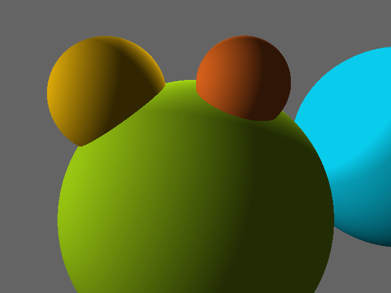
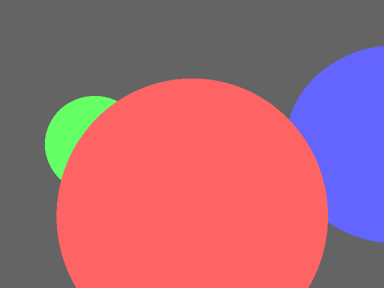

= Rayzz

A raytracer in https://ziglang.org/[Zig].

It can currently render a simple scene of spheres with point and ambient light.
No shadows or reflectsion yet.

I'm working from the book 
https://nostarch.com/computer-graphics-scratch[Computer Graphics from Scratch] by Gabriel Gambetta.
I'm learning a ton and enjoying myself very much.

This is what it can currently render:

This is what it rendered 10 months ago:

